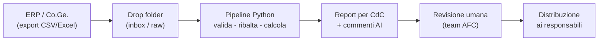

# Progetto-AI-CdC — Controllo di gestione automatizzato con AI

## Visione

Questo progetto automatizza la reportistica mensile del controllo di gestione di un'azienda con **oltre 300 centri di costo**. I numeri (ingestione dati, quadrature, ribaltamenti, scostamenti actual vs budget) sono prodotti da una **pipeline deterministica** in Python: codice testato, ripetibile e verificabile. L'**AI (Claude)** non calcola mai le cifre: orchestra la pipeline, redige i commenti agli scostamenti e supporta le analisi, compilando template i cui numeri provengono sempre dal dataset calcolato. Il risultato atteso: **report mensili per centro di costo disponibili entro pochi giorni dalla chiusura contabile**, con supervisione e approvazione umana prima della distribuzione ai responsabili.

## Come funziona il progetto



In sintesi: gli export mensili dell'ERP arrivano in una cartella di scambio, la pipeline li valida, quadra la contabilità analitica con la generale, esegue i ribaltamenti dei centri ausiliari e produce i report per centro di costo; l'AI aggiunge la narrativa sugli scostamenti; il team AFC rivede e approva; solo dopo i report vengono distribuiti.

## Mappa del repository

| Percorso | Contenuto |
|---|---|
| [`CLAUDE.md`](CLAUDE.md) | Guida operativa per Claude Code su questo progetto (regole, convenzioni, flussi di lavoro) |
| [`.claude/agents/`](.claude/agents/) | Sub-agenti dedicati: [controller di gestione](.claude/agents/controller-cdg.md), [data engineer](.claude/agents/data-engineer.md), [report builder](.claude/agents/report-builder.md), [QA quadrature](.claude/agents/qa-quadratura.md) |
| [`docs/00-contesto/`](docs/00-contesto/) | Contesto aziendale: [questionario compilabile](docs/00-contesto/questionario-contesto-aziendale.md), [glossario](docs/00-contesto/glossario.md), [mappa stakeholder](docs/00-contesto/mappa-stakeholder.md) |
| [`docs/01-processi/`](docs/01-processi/) | Processi: [as-is](docs/01-processi/processo-as-is.md), [to-be](docs/01-processi/processo-to-be.md), [calendario di chiusura](docs/01-processi/calendario-chiusura.md) |
| [`docs/02-dati/`](docs/02-dati/) | Dati: [inventario fonti](docs/02-dati/inventario-fonti-dati.md), [modello dati](docs/02-dati/modello-dati.md), [piano dei centri di costo](docs/02-dati/piano-centri-di-costo.md) |
| [`docs/03-reportistica/`](docs/03-reportistica/) | Reportistica: [requisiti dei report](docs/03-reportistica/requisiti-report.md), [catalogo KPI](docs/03-reportistica/catalogo-kpi.md) |
| [`docs/04-roadmap/`](docs/04-roadmap/) | [Roadmap del progetto](docs/04-roadmap/roadmap.md) per fasi |
| [`docs/05-metodologia/`](docs/05-metodologia/) | [Metodologia AI](docs/05-metodologia/metodologia-ai.md): principi, regole anti-allucinazione, uso dei sub-agenti |
| [`pipeline/`](pipeline/) | Pipeline dimostrativa: [README tecnico](pipeline/README.md), [config](pipeline/config/) (anagrafica ~320 CdC, piano dei conti, regole di ribaltamento), [src](pipeline/src/) (script Python) |
| `pipeline/output/` | Cartella generata dalla pipeline a ogni run: **non versionata** (vedi [`.gitignore`](.gitignore)) |

## Da dove iniziare

1. **Compilare il questionario di contesto** — [`docs/00-contesto/questionario-contesto-aziendale.md`](docs/00-contesto/questionario-contesto-aziendale.md): è un template con domande specifiche su azienda, organizzazione, sistemi e obiettivi. È la base su cui si adatta tutto il resto.
2. **Mappare l'as-is e le fonti dati** — descrivere il processo di chiusura attuale in [`docs/01-processi/`](docs/01-processi/) e censire gli export disponibili (ERP, paghe, cespiti…) in [`docs/02-dati/`](docs/02-dati/), incluso il piano dei centri di costo reale.
3. **Provare la pipeline demo** — con dati sintetici, per toccare con mano il flusso end-to-end:

   ```bash
   pip install -r pipeline/requirements.txt
   python3 pipeline/src/main.py --genera-dati --mese 2026-06
   ```

   I dettagli tecnici sono nel [README della pipeline](pipeline/README.md).

## Metodologia AI in breve

Il progetto segue i principi "alla Karpathy": il codice deterministico (Software 1.0) calcola ogni numero, l'LLM (Software 3.0) orchestra gli strumenti e scrive la narrativa, compilando template con placeholder risolti a valle dal codice — per costruzione, nessuna cifra nei report può nascere dal modello. I prompt sono trattati come codice: versionati nel repository e sottoposti a review, con il supporto del plugin **Superpowers** per il flusso brainstorming → piano → esecuzione e di **sub-agenti dedicati** per analisi, dati, report e quadrature. Approfondimenti in [`docs/05-metodologia/metodologia-ai.md`](docs/05-metodologia/metodologia-ai.md).

## Stato del progetto

| Fase | Descrizione | Stato |
|---|---|---|
| Fase 0 | Discovery: contesto, processi as-is, inventario fonti dati | **In corso** |
| Fase 1 | Fondamenta dati: anagrafiche pulite, contratto dati ERP, primo mese quadrato | Pianificata |
| Fase 2 | Pipeline MVP: validazioni, ribaltamenti e report Excel su un pilota di 20-30 CdC | Pianificata |
| Fase 3 | Estensione a tutti i 300+ CdC e report di sintesi | Pianificata |
| Fase 4 | Commento AI e distribuzione automatica (con approvazione umana) | Pianificata |
| Fase 5 | Industrializzazione: scheduling, storicizzazione, rolling forecast | Pianificata |

Il dettaglio di attività, milestone e criteri di uscita di ogni fase è in [`docs/04-roadmap/roadmap.md`](docs/04-roadmap/roadmap.md).

## Avvertenza sui dati

> **Tutti i dati presenti in questo repository sono sintetici e puramente dimostrativi** (anagrafiche, importi, centri di costo generati dalla pipeline demo). **I dati reali dell'azienda non vanno mai committati**: gli export ERP, i file di lavoro e gli output della pipeline sono esclusi dal versionamento tramite [`.gitignore`](.gitignore). Prima di ogni commit, verificare di non includere file con dati contabili reali.
