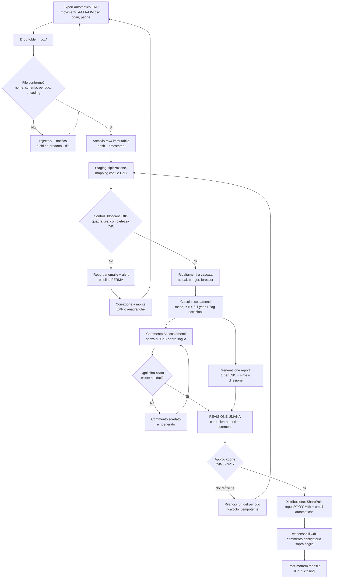

# Processo TO-BE — Chiusura e reporting mensile automatizzati

> **Owner:** Controllo di Gestione / AFC · **Stato:** ☐ bozza ☐ condiviso ☐ approvato
>
> Questo documento descrive il processo **target** a regime: una pipeline che parte dagli export dell'ERP e arriva ai report per centro di costo con commento AI agli scostamenti, mantenendo **l'approvazione umana come passaggio obbligatorio** prima di ogni invio ai responsabili. Il principio guida: **prima semplificare, poi automatizzare** — il TO-BE non replica gli Excel storici, li sostituisce con un modello di controllo ridisegnato.

Riferimenti: implementazione tecnica in [`pipeline/README.md`](../../pipeline/README.md), modello dati in [modello-dati.md](../02-dati/modello-dati.md), regole di uso dell'AI in [metodologia-ai.md](../05-metodologia/metodologia-ai.md), tempi in [calendario-chiusura.md](calendario-chiusura.md).

---

## 1. Principi di progettazione

1. **Determinismo dei numeri.** Tutti i calcoli (importi, ribaltamenti, scostamenti) sono prodotti da codice deterministico e versionato. L'AI **commenta** numeri già calcolati, **mai** li calcola.
2. **Idempotenza per periodo.** Ogni run riceve un periodo (es. `2026-06`) e riscrive integralmente i dati di quel mese: le rettifiche contabili tardive si gestiscono rilanciando il run, senza interventi manuali sui file.
3. **Nessun report non quadrato.** I controlli di qualità sono **bloccanti**: se una quadratura fallisce, la pipeline si ferma prima della generazione dei report e notifica l'anomalia.
4. **Human-in-the-loop obbligatorio.** Nessun report e nessun commento AI raggiunge un responsabile di CdC senza revisione e approvazione esplicita del controller. Questo vincolo non decade in nessuna fase di automazione.
5. **Gestione per eccezioni.** Con 300+ CdC il sistema evidenzia solo gli scostamenti sopra soglia (valori proposti in [requisiti-report.md, § 4](../03-reportistica/requisiti-report.md): giallo |Δ| > 5% **e** > 2.500 €, rosso |Δ| > 10% **e** > 5.000 €); il resto è disponibile ma non richiede attenzione.
6. **Single source of truth.** Un solo run ufficiale, un solo output per periodo, riconciliato in modo dimostrabile con la contabilità generale; il report ufficiale deve essere più tempestivo e affidabile di qualunque Excel ombra.

---

## 2. Il flusso a regime

### 2.1 Descrizione delle fasi

| Fase | Cosa accade | Automazione |
|---|---|---|
| **1. Export dall'ERP** | L'ERP produce con stampa/export schedulato i file del periodo (bilancino Co.Ge., movimenti analitici, costo del personale per CdC) secondo il contratto dati: nome convenzionale `movimenti_AAAA-MM.csv` (l'export grezzo dell'ERP, es. `coge_202606.csv`, viene rinominato al deposito), separatore, encoding e formato importi concordati | Automatica (schedulazione ERP) |
| **2. Drop folder** | I file arrivano nella cartella `inbox/`; la pipeline li rileva, ne verifica nome, schema, encoding e coerenza del periodo | Automatica |
| **3. Archiviazione raw** | I file validi sono archiviati immutabili in `raw/` con hash e timestamp e spostati in `processed/`; i file non conformi finiscono in `rejected/` con notifica immediata a chi li ha prodotti | Automatica |
| **4. Staging e validazione** | Tipizzazione (importi con virgola decimale → Decimal, date ISO), mapping conto → natura di costo, CdC → anagrafica ([piano-centri-di-costo.md](../02-dati/piano-centri-di-costo.md)); esecuzione dei **controlli bloccanti** (matrice al § 3) | Automatica |
| **5. Ribaltamenti** | Allocazione dei CdC ausiliari e di struttura sui CdC finali con metodo a cascata, sequenza e driver definiti in `regole_ribaltamento.csv`, identici per actual, budget e forecast | Automatica |
| **6. Calcolo scostamenti** | Actual vs budget vs forecast, mese e YTD, proiezione full-year; flag delle eccezioni sopra soglia | Automatica |
| **7. Generazione report** | Un report standard per ogni CdC (costi diretti controllabili separati dai costi allocati) + sintesi direzionale; layout unico per tutti i centri ([requisiti-report.md](../03-reportistica/requisiti-report.md)) | Automatica |
| **8. Commento AI** | Claude riceve la tabella scostamenti in JSON e produce bozze di commento gestionale in italiano per i CdC sopra soglia e per la sintesi direzionale; un check automatico verifica che ogni cifra citata esista nei dati di input | Automatica (bozza) |
| **9. Revisione umana** | Il controller esamina quadrature, eccezioni e bozze di commento: corregge, integra, respinge; in caso di anomalie rilancia il run del periodo | **Umana** |
| **10. Approvazione** | Il responsabile CdG/CFO approva formalmente il pacchetto del periodo (approvazione tracciata: chi, quando, quale versione del run) | **Umana** |
| **11. Distribuzione** | Pubblicazione su cartella condivisa/SharePoint (`report/YYYY-MM/`) e invio email automatico a ogni responsabile del **solo** proprio report; sintesi alla direzione | Automatica (dopo approvazione) |
| **12. Feedback e archiviazione** | Raccolta commenti dei responsabili sulle eccezioni, log del run archiviato, post-mortem mensile sui tempi | Mista |

### 2.2 Diagramma del flusso

---

## 3. Matrice dei controlli automatici

Tutti i controlli sono implementati come asserzioni deterministiche (query DuckDB che devono restituire zero righe, più validazione di schema) in [`pipeline/src/valida.py`](../../pipeline/src/valida.py). Esito **bloccante** = la pipeline si ferma e i report non vengono generati.

| # | Controllo | Descrizione | Quando | Tolleranza | Esito se fallisce |
|---|---|---|---|---|---|
| C1 | Conformità file | Nome file, colonne obbligatorie, separatore, encoding, periodo dichiarato = periodo del run | Ingest (inbox → raw) | Nessuna | Bloccante: file in `rejected/` + notifica |
| C2 | Parsing importi e date | Tutti gli importi convertiti (formato italiano → Decimal), tutte le date valide e nel periodo | Staging | Nessuna | Bloccante |
| C3 | Duplicati chiave | Nessuna riga duplicata su chiave (periodo, conto, CdC, riferimento) | Staging | Nessuna | Bloccante |
| C4 | Quadratura Co.Ge. | Dare = Avere per periodo; saldi coerenti con il bilancino di verifica | Staging → marts | 0,01 € | Bloccante |
| C5 | Quadratura Co.Ge./Co.An. | Totale costi sui CdC = totale conti di costo Co.Ge. per natura; delta documentati (poste solo civilistiche vs solo gestionali) | Staging → marts | 0,01 € | Bloccante |
| C6 | Completezza CdC | Tutti i CdC attivi in anagrafica presenti nel periodo; nessun CdC orfano fuori anagrafica; nessun costo su CdC chiusi | Staging → marts | Nessuna | Bloccante |
| C7 | Copertura mapping | Nessun conto Co.Ge. di costo non mappato su una natura; nessuna natura orfana | Staging → marts | Nessuna | Bloccante |
| C8 | Quadratura ribaltamenti | Somma allocata = somma da allocare per ogni centro erogante; CdC ausiliari a saldo zero dopo il ribaltamento | Post-ribaltamento | 0,01 € | Bloccante |
| C9 | Driver disponibili | Ogni regola di ribaltamento ha il valore del driver per il periodo (nessun driver mancante o a zero totale) | Pre-ribaltamento | Nessuna | Bloccante |
| C10 | Coerenza budget/forecast | Budget e forecast ribaltati con le stesse regole dell'actual; stessa granularità CdC × natura | Post-ribaltamento | Nessuna | Bloccante |
| C11 | Commento AI ancorato ai dati | Ogni valore numerico citato nel commento esiste nella tabella scostamenti di input | Post-commento AI | Nessuna | Non bloccante sul run: il singolo commento è scartato e rigenerato; oltre N tentativi, il CdC passa a commento manuale |
| C12 | Variazioni anomale | Scostamenti oltre soglia di allarme (es. \|Δ\| > 50% e > 25.000 €) segnalati come sospetti errori di dato, non solo come eccezioni gestionali | Post-scostamenti | Configurabile | Warning in revisione umana |

Ogni violazione produce un **report di anomalie** con il dettaglio delle righe interessate e un alert (email o webhook Teams/Slack). Le soglie di tolleranza sono parametri di configurazione versionati, non costanti nel codice.

---

## 4. Punti di intervento umano

| Punto | Chi | Cosa fa | Obbligatorio |
|---|---|---|---|
| Gestione file respinti | Contabilità / IT | Corregge a monte il file in `rejected/` e lo rideposita | Sì, quando accade |
| Sblocco anomalie dati | Controller | Analizza il report anomalie, corregge in ERP o nelle anagrafiche versionate (mapping conti, anagrafica CdC, driver), rilancia il run | Sì, quando accade |
| Manutenzione anagrafiche | Controller (owner), con processo autorizzativo | Aperture/chiusure CdC, modifiche mapping e driver: mai in corso d'anno per i driver, sempre con versioning | Sì, continuativo |
| **Revisione del pacchetto** | Controller | Verifica quadrature, esamina le eccezioni, valida/corregge le bozze di commento AI | **Sì, ogni mese** |
| **Approvazione formale** | Responsabile CdG / CFO | Approva la versione del run da pubblicare; l'approvazione è tracciata | **Sì, ogni mese, prima di qualunque invio** |
| Commento dei responsabili | Responsabili di CdC | Commento obbligatorio solo sugli scostamenti sopra soglia; escalation su scostamenti ricorrenti | Sì, per eccezione |
| Post-mortem del closing | Team AFC | Rivede tempi, ritardi e rettifiche del mese; aggiorna calendario e soglie | Raccomandato, mensile |

---

## 5. Livelli di automazione progressivi ("autonomy slider")

L'automazione cresce per gradi: si sposta il cursore solo quando il livello precedente è stabile (criteri di uscita misurabili). A **tutti** i livelli la revisione e l'approvazione umana prima dell'invio restano obbligatorie: il cursore sposta il *quando* e il *quanto spesso* interviene l'uomo, mai il *se*.

I livelli di automazione del **processo** (A1–A3, qui sotto) si raccordano con i livelli di autonomia dell'**AI sui contenuti** (L0–L3, definiti in [metodologia-ai.md, § 1.3](../05-metodologia/metodologia-ai.md)) così: A1 ≈ L0–L1 (bozze da riscrivere), A2 ≈ L2 (generazione completa con approvazione), A3 ≈ L3 ma solo per i flussi interni a basso rischio — il fascicolo direzionale resta sempre almeno L2. I nomi sono distinti (A vs L) per non confonderli tra loro né con le Fasi 0–5 della [roadmap](../04-roadmap/roadmap.md).

### Livello A1 — Pipeline assistita (lancio manuale)

- Il controller lancia manualmente il run (`python3 pipeline/src/main.py --mese 2026-06`) dopo aver verificato la disponibilità dei file in `inbox/`.
- Ogni output intermedio (staging, ribaltamenti, scostamenti) viene ispezionato; i risultati sono confrontati **in parallelo** con il processo Excel esistente per almeno 2-3 chiusure.
- I commenti AI sono bozze che il controller riscrive liberamente.
- **Criteri per passare al livello A2:** 3 chiusure consecutive con quadrature C1-C10 superate al primo o secondo run; scostamenti pipeline vs Excel storico riconciliati; calendario [WD8](calendario-chiusura.md) rispettato.

### Livello A2 — Pipeline schedulata con approvazione

- Il run parte automaticamente (cron/Task Scheduler) all'arrivo dei file o a calendario; il controller riceve la notifica di esito.
- Il processo Excel parallelo è dismesso; la pipeline è la fonte ufficiale.
- Il controller interviene solo su: anomalie segnalate, revisione delle eccezioni, validazione dei commenti AI (che ormai richiedono per lo più ritocchi, non riscritture).
- La distribuzione parte **solo** dopo il click di approvazione del CdG/CFO.
- **Criteri per passare al livello A3:** 6 chiusure al livello A2 senza rettifiche post-pubblicazione imputabili alla pipeline; tasso di modifica dei commenti AI sotto una soglia concordata (es. < 20% dei commenti ritoccati in modo sostanziale); fiducia esplicita dei responsabili di CdC (niente Excel ombra sulle voci coperte).

### Livello A3 — Completamente automatica con supervisione a campione

- Run, controlli, report e commenti procedono senza intervento; il controller riceve un cruscotto di sintesi con le sole eccezioni e un **campione** di report/commenti da verificare (es. 10% dei CdC a rotazione + tutti quelli sopra soglia di allarme C12).
- L'approvazione formale del pacchetto resta un atto umano esplicito, ma diventa una review di eccezioni, non una verifica riga per riga.
- Rollback sempre disponibile: qualunque anomalia riporta il periodo al livello A2 (revisione integrale) senza modifiche al codice, essendo il run idempotente.
- **Presidi permanenti:** audit trail di run e approvazioni, versioning di regole e anagrafiche, misura continua dei KPI di closing e della forecast accuracy.

| Aspetto | Livello A1 | Livello A2 | Livello A3 |
|---|---|---|---|
| Avvio del run | Manuale | Schedulato | Schedulato |
| Verifica output intermedi | Integrale | Solo anomalie | A campione |
| Confronto con processo legacy | Parallelo obbligatorio | Dismesso | — |
| Commenti AI | Bozza da riscrivere | Bozza da validare | Validazione a campione + eccezioni |
| Revisione pre-invio | Integrale | Per eccezioni | Per eccezioni + campione |
| **Approvazione umana pre-invio** | **Obbligatoria** | **Obbligatoria** | **Obbligatoria** |

---

## 6. Cosa NON fa il processo TO-BE

Per evitare ambiguità con gli stakeholder, a regime il sistema **non**:

- non calcola numeri con l'AI, né lascia che l'AI modifichi dati, mapping o regole di ribaltamento;
- non invia nulla ai responsabili senza approvazione umana tracciata;
- non pubblica report se una quadratura bloccante è fallita, nemmeno "in via provvisoria";
- non modifica i file ricevuti dall'ERP: `raw/` è immutabile, ogni correzione avviene a monte (ERP) o nelle anagrafiche versionate;
- non sostituisce il giudizio del controller sull'interpretazione degli scostamenti: lo libera dal tempo di produzione del dato perché possa esercitarlo.

---

*Documenti collegati: [processo-as-is.md](processo-as-is.md) (punto di partenza), [calendario-chiusura.md](calendario-chiusura.md) (tempi target), [roadmap.md](../04-roadmap/roadmap.md) (piano di adozione delle fasi), [metodologia-ai.md](../05-metodologia/metodologia-ai.md) (regole d'uso dell'AI).*
