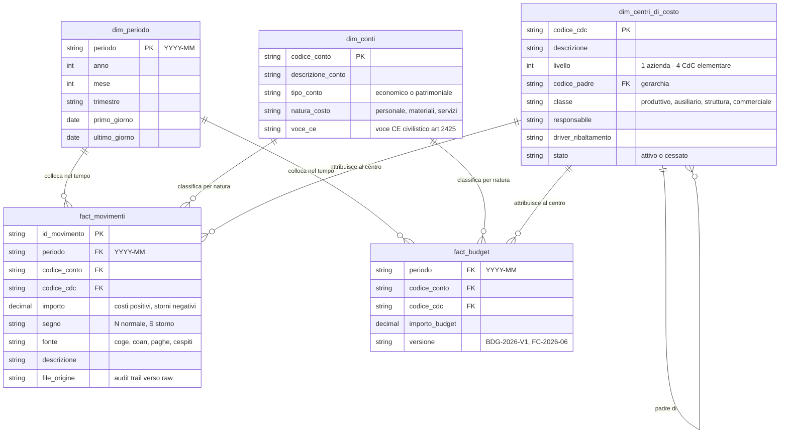

# Modello dati target

> Questo documento descrive **come sono organizzati i dati** della piattaforma di controllo di gestione: i tre livelli di elaborazione, le tabelle del modello dimensionale, le convenzioni e i controlli di qualità. È scritto per il team AFC: non serve saper programmare per capirlo, serve conoscerlo per fidarsi dei numeri.

## 1. Perché serve un modello dati

Con 300+ centri di costo e una decina di fonti (Co.Ge., Co.An., paghe, cespiti, budget…) non è sostenibile che ogni report "peschi" direttamente dagli export ERP: ogni numero deve nascere da **un'unica tabella ufficiale**, ricostruibile e quadrata con il bilancino di verifica. Il modello dati è il punto in cui i file censiti nell'[inventario delle fonti](inventario-fonti-dati.md) diventano tabelle pulite, collegate tra loro e pronte per la reportistica.

## 2. Architettura a tre livelli: raw, staging, marts

L'approccio (detto "medallion" nel gergo tecnico) è una semplice catena di raffinazione, realizzata su filesystem senza bisogno di un database server:

| Livello | Cosa contiene | Formato | Regola fondamentale |
|---------|---------------|---------|---------------------|
| **raw** ("materia prima") | Gli export ERP **esattamente come arrivati**, archiviati per fonte e periodo (es. `raw/coge/2026-06/`) | CSV/XLSX originali + manifest con hash e data di arrivo | Immutabile: non si corregge mai un file raw, si ri-estrae dalla fonte |
| **staging** ("semilavorato") | Dati puliti e tipizzati: importi convertiti in numero, date in formato ISO, codici CdC e conti validati contro le anagrafiche | Parquet | Una riga in staging è sempre riconducibile alla riga raw di origine |
| **marts** ("prodotto finito") | Le tabelle del modello dimensionale (sez. 3) e le tabelle derivate pronte per i report: conto economico per CdC, actual vs budget, scostamenti, ribaltamenti | Parquet | Si pubblica solo se **tutti i controlli bloccanti** (sez. 6) sono superati |

Due principi tecnici che garantiscono numeri sempre ricostruibili:

- **Partizionamento per periodo**: ogni tabella è organizzata per mese contabile (`periodo=2026-06`), sia nei percorsi sia nelle chiavi.
- **Idempotenza con ricalcolo del periodo**: ogni esecuzione della pipeline riceve un periodo (es. `--mese 2026-06`), cancella e riscrive integralmente staging e marts di quel mese. Rilanciare dieci volte produce lo stesso risultato; una rettifica contabile tardiva si gestisce semplicemente rilanciando il mese.

## 3. Il modello dimensionale (schema a stella)

Il cuore dei marts è uno **schema a stella**: al centro le tabelle dei **fatti** (gli importi, una riga per movimento), intorno le **dimensioni** (le anagrafiche che danno significato agli importi: quale centro, quale conto, quale mese). I report si costruiscono incrociando fatti e dimensioni.

### 3.1 `fact_movimenti` — i movimenti economici (actual)

Granularità: una riga per movimento analitico di costo. È l'unica origine dei numeri "actual" di tutti i report.

| Colonna | Tipo | Descrizione |
|---------|------|-------------|
| `id_movimento` | testo | Chiave tecnica univoca (hash di fonte + riferimenti della riga di origine) |
| `periodo` | testo `YYYY-MM` | Mese di competenza economica (non la data di registrazione) |
| `codice_conto` | testo | Conto Co.Ge., riferimento a `dim_conti` |
| `codice_cdc` | testo | Centro di costo, riferimento a `dim_centri_di_costo` |
| `importo` | decimale (2 cifre) | Importo in euro **con segno**: costi positivi, storni/rettifiche/note credito negativi |
| `segno` | testo | Tipo movimento: `N` = normale, `S` = storno/rettifica (per tracciabilità e audit) |
| `fonte` | testo | Sistema di provenienza: `coge`, `coan`, `paghe`, `cespiti`, `magazzino` |
| `descrizione` | testo | Descrizione/causale della registrazione di origine |
| `file_origine` | testo | Nome del file raw da cui proviene la riga (audit trail) |

### 3.2 `fact_budget` — budget e forecast

Stessa granularità logica di `fact_movimenti` (periodo × conto × CdC), con in più la **versione**: budget e forecast non si sovrascrivono mai, si affiancano.

| Colonna | Tipo | Descrizione |
|---------|------|-------------|
| `periodo` | testo `YYYY-MM` | Mese di competenza |
| `codice_conto` | testo | Conto o natura di costo, riferimento a `dim_conti` |
| `codice_cdc` | testo | Centro di costo, riferimento a `dim_centri_di_costo` |
| `importo_budget` | decimale (2 cifre) | Importo mensilizzato, stesse convenzioni di segno dei movimenti |
| `versione` | testo | *es. `BDG-2026-V1` (budget approvato), `FC-2026-06` (forecast aggiornato a giugno)* |

### 3.3 `dim_centri_di_costo` — anagrafica CdC con gerarchia

Alimentata da [pipeline/config/centri_di_costo.csv](../../pipeline/config/centri_di_costo.csv); regole di codifica e governance in [piano-centri-di-costo.md](piano-centri-di-costo.md).

| Colonna | Tipo | Descrizione |
|---------|------|-------------|
| `codice_cdc` | testo | Chiave, stabile nel tempo, mai riutilizzata |
| `descrizione` | testo | Denominazione del centro |
| `livello` | intero | 1 = azienda, 2 = area, 3 = reparto, 4 = CdC elementare |
| `codice_padre` | testo | Codice del nodo di livello superiore (vuoto per il livello 1): definisce la gerarchia |
| `classe` | testo | `produttivo`, `ausiliario`, `struttura`, `commerciale` |
| `responsabile` | testo | Un solo responsabile per centro |
| `driver_ribaltamento` | testo | Driver di default per l'allocazione (solo centri ausiliari/struttura) |
| `stato` | testo | `attivo` / `cessato` (i cessati restano in anagrafica per lo storico) |

> **Raccordo modello target vs CSV demo.** Lo schema qui sopra è il **modello target** per i dati reali. Il file demo `centri_di_costo.csv` attualmente se ne discosta in tre punti: usa il flag `attivo` (SI/NO) al posto di `stato` (attivo/cessato), si ferma al livello 3 (1 = azienda/sede, 2 = area funzionale, 3 = CdC elementare) e denormalizza il livello 1 nella colonna aggiuntiva `area`. L'allineamento completo dell'anagrafica avverrà in Fase 1 della [roadmap](../04-roadmap/roadmap.md).

### 3.4 `dim_conti` — piano dei conti e nature di costo

Alimentata da [pipeline/config/piano_dei_conti.csv](../../pipeline/config/piano_dei_conti.csv). Il mapping conto → natura è la tabella di raccordo Co.Ge./Co.An. ed è sotto governance del controllo di gestione.

| Colonna | Tipo | Descrizione |
|---------|------|-------------|
| `codice_conto` | testo | Chiave, codice del conto Co.Ge. |
| `descrizione_conto` | testo | Denominazione del conto |
| `tipo_conto` | testo | `economico` / `patrimoniale` |
| `natura_costo` | testo | Riclassifica gestionale: *personale, materiali, servizi, godimento beni terzi, ammortamenti, altri costi* |
| `voce_ce` | testo | Voce dello schema di conto economico civilistico (art. 2425 c.c.) per la riconciliazione |

> **Raccordo modello target vs CSV demo.** Il file demo `piano_dei_conti.csv` contiene solo conti economici di costo e usa la colonna `classe_cee` (B6-B14), che corrisponde a `voce_ce` del modello target; `tipo_conto` non è presente perché nella demo tutti i conti sono economici. Anche qui l'allineamento avverrà in Fase 1 con il piano dei conti reale.

### 3.5 `dim_periodo` — calendario contabile

Generata automaticamente; serve per ordinare i mesi, calcolare YTD e confrontare anni.

| Colonna | Tipo | Descrizione |
|---------|------|-------------|
| `periodo` | testo `YYYY-MM` | Chiave |
| `anno` | intero | *2026* |
| `mese` | intero | 1–12 |
| `trimestre` | testo | *`2026-Q2`* |
| `primo_giorno` / `ultimo_giorno` | data | Estremi del mese, per i cut-off |

## 4. Diagramma del modello

## 5. Convenzioni

| Ambito | Convenzione |
|--------|-------------|
| **Periodo** | Sempre testo `YYYY-MM` con zero iniziale (`2026-06`, mai `2026-6` né `06/2026`). È la chiave di partizionamento di tutte le tabelle |
| **Chiavi** | Le dimensioni usano i codici di anagrafica come chiave (`codice_cdc`, `codice_conto`, `periodo`); i fatti le referenziano. Chiave tecnica `id_movimento` per l'audit riga per riga |
| **Segni** | Costi con importo **positivo**; storni, rettifiche e note credito **negativi**. Il totale costi di un CdC è quindi una semplice somma. Il campo `segno` (`N`/`S`) conserva la natura del movimento |
| **Importi** | Decimali a 2 cifre in euro (mai virgola mobile/float); il parsing del formato italiano (`1.234,56`) avviene una sola volta, al passaggio raw → staging |
| **Codici** | I codici CdC e conto sono testo (mai numeri: `010` deve restare `010`), maiuscoli, senza spazi |
| **Versioni budget/forecast** | Mai sovrascrivere: ogni revisione è una nuova `versione` in `fact_budget`. I ribaltamenti si applicano con le stesse regole ad actual, budget e forecast |
| **Valori ammessi `fonte`** | `coge`, `coan`, `paghe`, `cespiti`, `magazzino` — l'elenco si estende solo aggiornando questo documento |

## 6. Controlli di qualità per livello

Ogni passaggio di livello è protetto da controlli automatici. I controlli **bloccanti** fermano la pipeline e impediscono la pubblicazione dei report: mai pubblicare numeri non quadrati. Implementazione: query SQL in DuckDB che devono restituire zero righe, più validazione di schema sui DataFrame (`pipeline/src/valida.py`).

| Passaggio | Controllo | Severità | Esito se fallisce |
|-----------|-----------|----------|-------------------|
| inbox → raw | Nome file conforme, periodo dichiarato e coerente, encoding riconosciuto, tracciato conforme al contratto dati | Bloccante | File spostato in `rejected/`, notifica all'owner della fonte |
| raw → staging | Importi convertibili, date valide e interne al periodo, nessun duplicato di chiave | Bloccante | Run interrotto, report anomalie con le righe incriminate |
| raw → staging | Ogni `codice_cdc` esiste in anagrafica (nessun CdC "orfano"); ogni conto è mappato a una natura di costo | Bloccante | Run interrotto: si corregge l'anagrafica o il mapping, poi si rilancia |
| staging → marts | Quadratura Co.Ge.: dare = avere per periodo; saldi movimenti = bilancino di verifica (tolleranza 0,01 €) | Bloccante | Pubblicazione bloccata, delta dettagliato per conto |
| staging → marts | Riconciliazione Co.Ge./Co.An.: totale costi sui CdC = totale conti economici di costo, con delta spiegati (poste solo civilistiche vs solo gestionali) | Bloccante | Pubblicazione bloccata |
| marts | Ribaltamenti a somma zero: quanto scaricato dai centri ausiliari = quanto ricevuto dai destinatari; quote di ogni regola = 100% | Bloccante | Pubblicazione bloccata, verifica di [regole_ribaltamento.csv](../../pipeline/config/regole_ribaltamento.csv) |
| marts | Completezza: tutti i CdC attivi attesi hanno movimenti o assenza giustificata; confronto righe/totali col mese precedente | Avviso | Segnalazione nel report anomalie, pubblicazione consentita |
| marts | Ogni numero citato nei commenti generati dall'AI esiste nella tabella scostamenti di input | Bloccante | Commento scartato e rigenerato (l'AI commenta i numeri, non li calcola) |

## 7. Collegamenti

- [Inventario delle fonti dati](inventario-fonti-dati.md) — cosa entra nel livello raw e con quali contratti.
- [Piano dei centri di costo](piano-centri-di-costo.md) — contenuto e governance di `dim_centri_di_costo` e delle regole di ribaltamento.
- [Requisiti di reportistica](../03-reportistica/requisiti-report.md) — cosa viene costruito a partire dai marts.
- [pipeline/README.md](../../pipeline/README.md) — come eseguire la pipeline che implementa questo modello.
- [Glossario](../00-contesto/glossario.md) — definizioni di fatti, dimensioni, staging e degli altri termini.
