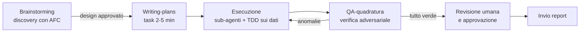

# Metodologia AI del progetto

> Questo documento definisce **come** si usa l'intelligenza artificiale nel Progetto-AI-CdC: i principi di fondo, gli strumenti (plugin Superpowers e sub-agenti), le regole di sicurezza sui dati contabili e gli anti-pattern da evitare. È la "costituzione" del progetto: ogni automazione, script o report generato con l'aiuto dell'AI deve rispettarla. I destinatari sono il team AFC, l'imprenditore e chiunque lavori nel repository con Claude Code.

Documenti collegati: [CLAUDE.md](../../CLAUDE.md) (guida operativa per Claude Code), [roadmap](../04-roadmap/roadmap.md), [processo to-be](../01-processi/processo-to-be.md), [glossario](../00-contesto/glossario.md).

---

## 1. Principi guida (ispirati ad Andrej Karpathy)

Andrej Karpathy (ex direttore AI di Tesla, co-fondatore di OpenAI, oggi fondatore di Eureka Labs) ha elaborato il quadro concettuale più citato su come usare LLM e agenti in modo produttivo e sicuro. I suoi principi, pensati per lo sviluppo software, si traducono quasi alla lettera nel controllo di gestione, dove i numeri devono essere esatti, riconciliati e firmati da un responsabile.

### 1.1 I numeri li calcola la pipeline, l'AI li spiega

È il principio fondante del progetto, non negoziabile:

- **Ogni cifra** che compare in un report nasce da codice deterministico (gli script Python/pandas in [`pipeline/src/`](../../pipeline/src/)): somme, ribaltamenti, scostamenti, percentuali.
- **L'LLM non calcola mai un valore contabile.** Fa tre cose soltanto: traduce le richieste in chiamate agli strumenti, orchestra la pipeline, e scrive la narrativa attorno a numeri già calcolati e verificati.
- I commenti generati dall'AI riempiono **template con segnaposto** (es. `{costo_totale_cdc}`, `{delta_pct_vs_budget}`) risolti dal codice a valle: così è **strutturalmente impossibile** che nel testo compaia una cifra inventata.
- Ogni numero deve avere un **lineage**: deve essere tracciabile al file di output e alla trasformazione che lo ha prodotto (es. "da `pipeline/output/2026-06/scostamenti.csv`, riga CdC S1-PRD-001").

### 1.2 L'LLM come orchestratore di strumenti deterministici (il "LLM OS")

Karpathy propone di pensare all'LLM come al kernel di un sistema operativo: il modello è la CPU, la context window è la RAM (scarsa e costosa), il tool use — eseguire script, leggere file, interrogare basi dati — corrisponde alle system call. Implicazioni pratiche per questo progetto:

| Concetto Karpathy | Traduzione per il controllo di gestione |
|---|---|
| Il modello è la CPU, i tool sono le periferiche | L'AI **invoca** `main.py`, `valida.py`, `ribalta.py`; non li sostituisce mai "a mente" |
| La context window è RAM scarsa | Nel contesto entrano solo: schema dati, glossario, regole di ribaltamento, dati del periodo in esame. Mai l'intero mastro contabile |
| Software 1.0 / 2.0 / 3.0 coesistono | ETL, calcoli e quadrature = Software 1.0 (Python testato); linguaggio naturale = solo interfaccia, narrativa e sintesi degli scostamenti |
| I prompt sono programmi | I prompt ricorrenti (template di commento, istruzioni dei sub-agenti) vivono **nel repository**, versionati e sottoposti a review come qualsiasi modulo di codice |
| "Anterograde amnesia": nessuna memoria tra sessioni | Lo stato del processo (report approvati, correzioni ricorrenti, preferenze della direzione) vive in file versionati nel repo, mai "nella chat" |
| Modelli commerciali, non modelli propri | Non si addestra né si fa fine-tuning di alcun modello: si usano modelli di frontiera via API. Per i passaggi critici è ammessa una "seconda opinione" con un secondo modello |

### 1.3 Autonomy slider applicato ai report

Karpathy raccomanda un "autonomy slider": livelli crescenti di autonomia, regolati in base al rischio e alla fiducia maturata. Per la reportistica mensile adottiamo questa scala, **per singolo flusso di report** (non per l'intero sistema):

| Livello | Chi fa cosa | Condizione per salire al livello successivo |
|---|---|---|
| **L0 — Manuale assistito** | Il controller produce il report; l'AI risponde a domande puntuali e propone frasi | Pipeline stabile e quadrature automatiche attive |
| **L1 — Bozza proposta** | L'AI genera la bozza di report e commenti; il controller verifica **ogni numero e ogni frase** e riscrive dove serve | 3 mesi consecutivi senza correzioni sostanziali ai numeri (i commenti possono ancora richiedere ritocchi) |
| **L2 — Generazione completa, approvazione umana** | L'AI genera report completo e commenti; il controller confronta con il mese precedente, controlla gli scostamenti evidenziati e **approva formalmente** prima dell'invio | 6 mesi consecutivi con approvazione senza rilievi e QA-quadratura sempre verde |
| **L3 — Invio automatico (solo flussi a basso rischio)** | Report interni di dettaglio (es. tabulati per capi centro) inviati automaticamente se tutti i controlli di quadratura passano; il fascicolo direzionale resta **sempre almeno L2** | Non previsto oltre: il report per la direzione e ogni documento verso l'esterno non superano mai L2 |

Regole della scala:
- Si parte **sempre da L0/L1** per ogni nuovo report o nuova sezione.
- Un errore sui numeri riporta il flusso al livello precedente finché non si ricostruisce lo storico.
- Il passaggio di livello è una **decisione esplicita** del responsabile AFC, registrata nella [roadmap](../04-roadmap/roadmap.md).
- La scala L0–L3 misura l'autonomia dell'AI sui **contenuti**; l'automazione del **processo** di chiusura ha una scala propria, A1–A3, definita in [processo-to-be.md, § 5](../01-processi/processo-to-be.md). Raccordo: A1 ≈ L0–L1, A2 ≈ L2, A3 ≈ L3 (quest'ultimo solo per i flussi interni a basso rischio).

### 1.4 Ciclo generazione-verifica rapido

Il throughput del sistema uomo+AI dipende dalla velocità del ciclo generazione → verifica. Se la verifica è più lenta della generazione, l'uomo diventa il collo di bottiglia e — peggio — smette di verificare. Perciò:

- Ogni report generato include il **confronto con il periodo precedente** e con il budget, con gli scostamenti già evidenziati: il controller guarda le eccezioni, non 320 righe una per una.
- I controlli deterministici vengono **prima** dell'occhio umano: la pipeline blocca la pubblicazione se le quadrature falliscono (somma dettagli = totale, riconciliazione Co.Ge./Co.An., totale pre = totale post ribaltamento). L'uomo verifica solo ciò che le macchine non possono verificare: la sensatezza economica e i commenti.
- Il sub-agente [qa-quadratura](../../.claude/agents/qa-quadratura.md) fa da verificatore adversariale automatico prima di ogni consegna.

### 1.5 Piccoli incrementi verificabili ("AI on the leash")

Un output enorme è inverificabile per costruzione. Regole operative:

- Mai chiedere "genera tutto il fascicolo di chiusura mensile" in un colpo solo: si procede **un report, una sezione, un KPI alla volta**, verificando ogni incremento.
- Le modifiche alla pipeline sono piccole e atomiche: una regola di ribaltamento, un controllo di validazione, un formato di colonna per volta, ciascuna verificata rieseguendo la pipeline (vedi [CLAUDE.md](../../CLAUDE.md)).
- Ogni output dell'AI va trattato come **la bozza di uno stagista brillante ma inaffidabile**: allucinazioni e "jagged intelligence" (brillante sul difficile, fallace sul banale) sono difetti strutturali dei modelli, non incidenti. La fiducia si costruisce con lo storico delle verifiche superate, non si presume.

---

## 2. Il plugin Superpowers

### 2.1 Che cos'è

[Superpowers](https://github.com/obra/superpowers) (autore Jesse Vincent, GitHub `obra`) è un plugin per Claude Code che fornisce una **metodologia di lavoro completa** sotto forma di 14 skill componibili: brainstorming guidato, scrittura ed esecuzione di piani, sviluppo con sub-agenti, TDD, debugging sistematico, verifica prima del completamento, code review e altro. È tra i plugin più diffusi dell'ecosistema (circa 260.000 stelle su GitHub, licenza MIT, release v6.1.1 di luglio 2026, manutenzione attiva). Le skill si attivano da sole quando il contesto lo richiede, oppure si invocano esplicitamente; non serve configurazione dopo l'installazione.

### 2.2 Installazione

Due strade equivalenti, dall'interno di Claude Code.

Dal marketplace ufficiale Anthropic (consigliata):

```
/plugin install superpowers@claude-plugins-official
```

Oppure dal marketplace dell'autore, in due passi:

```
/plugin marketplace add obra/superpowers-marketplace
/plugin install superpowers@superpowers-marketplace
```

Complemento utile per gli output di questo progetto — le document skill ufficiali Anthropic (xlsx, docx, pptx, pdf):

```
/plugin marketplace add anthropics/skills
/plugin install document-skills@anthropic-agent-skills
```

> **Nota:** nell'ambiente Claude Code di questo progetto le skill `xlsx`, `docx`, `pdf`, `pptx` e `dataviz` risultano già disponibili: verificare con `/plugin` o chiedendo a Claude prima di installare duplicati.

### 2.3 Le skill da usare in questo progetto e come

| Skill | Quando usarla nel Progetto-AI-CdC | Come |
|---|---|---|
| **brainstorming** | All'inizio di ogni nuovo report, KPI o modifica strutturale (nuova fonte dati, nuova regola di ribaltamento). Perfetta per la fase di **discovery** con il team AFC | La skill fa domande una alla volta (scopo, destinatari, fonti, formato, frequenza), propone 2-3 approcci con pro e contro e produce un documento di design. **Cancello rigido:** nessun codice finché il design non è approvato dall'utente |
| **writing-plans** | Dopo l'approvazione di un design: trasforma "automatizza il report mensile" in task piccoli e verificabili (estrazione, pulizia, calcolo KPI, formattazione, controlli) | Ogni task da 2-5 minuti con specifica esatta, eseguibile da un agente senza contesto pregresso. I piani si salvano nel repository |
| **executing-plans** / **subagent-driven-development** | Esecuzione dei piani: ogni task viene svolto da un sub-agente "fresco", con revisione a due stadi (conformità alla specifica, poi qualità) | Utile per processare più fonti o più report in parallelo con contesto pulito per ciascuno (`dispatching-parallel-agents`) |
| **test-driven-development** (adattato ai dati) | Ogni modifica agli script di calcolo e quadratura | **Adattamento chiave del progetto:** invece di unit test classici, si scrivono prima le *attese sui dati* — totali di controllo, conteggi di righe, vincoli di validità — e soprattutto si confronta l'output della pipeline **con il report manuale esistente** dello stesso mese (parallel run). La trasformazione è "verde" solo quando riproduce i totali del report manuale al centesimo o le differenze sono spiegate e documentate |
| **systematic-debugging** | Quando "i numeri non tornano": una quadratura fallisce, un CdC manca, un totale diverge dal gestionale | Si traccia la **causa radice** (quale riga, quale regola, quale join) invece di aggiustare il sintomo con una correzione manuale. Vietato "sistemare" un totale a mano |
| **verification-before-completion** | Prima di dichiarare concluso qualunque task | Tradotto per il progetto: **mai consegnare un report senza aver rieseguito la pipeline e ricontrollato i totali contro la fonte**. "Fatto" senza prova non esiste |
| **writing-skills** | Quando una procedura del progetto diventa ricorrente (es. "come si produce il report CdC mensile", "come si carica un nuovo mese") | Si codifica la procedura come skill personalizzata riutilizzabile, versionata nel repository |

Le skill più orientate alla software house (`using-git-worktrees`, `finishing-a-development-branch`, `requesting/receiving-code-review`) sono utili quando si lavora su rami separati della pipeline, ma non sono centrali per il team AFC.

### 2.4 Il flusso di lavoro standard del progetto



---

## 3. I sub-agenti di questo repository

In [`.claude/agents/`](../../.claude/agents/) sono definiti quattro sub-agenti specializzati. Claude Code li invoca automaticamente quando il compito corrisponde alla loro descrizione, oppure si possono chiamare esplicitamente ("usa il sub-agente qa-quadratura per verificare l'output di giugno"). Ognuno lavora con contesto pulito, quindi riceve solo le informazioni pertinenti al suo compito.

| Sub-agente | File | Quando usarlo |
|---|---|---|
| **controller-cdg** | [controller-cdg.md](../../.claude/agents/controller-cdg.md) | Interpretare scostamenti, scrivere i commenti dei report, rispondere a domande di merito economico. Legge i numeri della pipeline, **non ne calcola mai** |
| **data-engineer** | [data-engineer.md](../../.claude/agents/data-engineer.md) | Modificare o estendere la pipeline, i tracciati, le configurazioni; ottimizzare le performance. Ogni modifica con test di quadratura prima/dopo |
| **report-builder** | [report-builder.md](../../.claude/agents/report-builder.md) | Creare o migliorare i template Excel/HTML dei report: layout, formattazione professionale, leggibilità. Verifica sempre l'output ispezionando i file generati |
| **qa-quadratura** | [qa-quadratura.md](../../.claude/agents/qa-quadratura.md) | Verifica adversariale prima di ogni consegna: quadrature Co.Ge./Co.An., totali pre/post ribaltamento, completezza dei 300+ CdC, coerenza report-dati. Output: lista di anomalie con gravità |

Regola di composizione: per la chiusura mensile la sequenza tipica è **data-engineer** (se servono modifiche) → pipeline → **qa-quadratura** → **controller-cdg** (commenti) → **report-builder** (impaginazione) → di nuovo **qa-quadratura** sul fascicolo finale → revisione umana.

---

## 4. Sicurezza e riservatezza dei dati contabili

I dati trattati sono dati economici aziendali riservati. Regole vincolanti, da raccordare con la sezione "Riservatezza e vincoli IT" del [questionario di contesto](../00-contesto/questionario-contesto-aziendale.md):

### 4.1 Cosa si può condividere con l'AI

- **Sì:** schemi dati, tracciati, piano dei centri di costo, piano dei conti, regole di ribaltamento, dati economici aggregati per CdC e natura, dati di esempio generati sinteticamente ([`genera_dati_esempio.py`](../../pipeline/src/genera_dati_esempio.py)).
- **Con cautela e solo se necessario al compito:** dati consuntivi reali del periodo in lavorazione, limitati al perimetro del report da produrre (context window come RAM: caricare solo ciò che serve).
- **No, mai:** dati personali dei dipendenti (retribuzioni individuali, dati sanitari, valutazioni), credenziali e chiavi di accesso ai sistemi, dati di terzi coperti da NDA, qualunque dato che la policy IT aziendale classifichi come non conferibile a servizi cloud.

### 4.2 Anonimizzazione (se richiesta dalla policy aziendale)

Se la policy IT lo richiede, prima di condividere dati reali con l'AI si applica una pseudonimizzazione **deterministica e reversibile solo internamente**:

- codici CdC e descrizioni sostituiti da codici neutri (la tabella di mappatura resta su sistemi aziendali, fuori dal contesto AI);
- ragioni sociali di clienti/fornitori sostituite da identificativi generici;
- eventuale riscalatura degli importi con un fattore riservato, se anche gli ordini di grandezza sono sensibili (attenzione: la riscalatura preserva le percentuali di scostamento ma non i valori assoluti — documentare la scelta).

### 4.3 Human-in-the-loop obbligatorio

- **Nessun report esce dall'azienda, né arriva alla direzione, senza approvazione esplicita di una persona** (controller o responsabile AFC). Vale a qualunque livello dell'autonomy slider, con la sola eccezione dei flussi interni formalmente promossi a L3 (§ 1.3).
- Il responsabile che approva **firma** il report: la responsabilità del contenuto resta umana, sempre. L'AI è un'app ad autonomia parziale che aumenta il throughput del team, non un sostituto del presidio.
- Le approvazioni e le correzioni ricorrenti si registrano in file versionati nel repository, così diventano contesto per i mesi successivi.

### 4.4 Checklist di riservatezza (prima di ogni sessione con dati reali)

- [ ] Ho verificato che i dati che sto per condividere rientrano tra quelli ammessi (§ 4.1)?
- [ ] La policy aziendale richiede anonimizzazione per questi dati? Se sì, è stata applicata?
- [ ] Sto caricando solo i dati del periodo/perimetro necessario al compito?
- [ ] Nel contesto non ci sono credenziali, dati personali o documenti di terzi?
- [ ] È chiaro chi approverà l'output prima di qualunque invio?

---

## 5. Anti-pattern da evitare

| Anti-pattern | Perché è un errore | Cosa fare invece |
|---|---|---|
| **Chiedere all'LLM di sommare colonne** (o calcolare scostamenti, percentuali, ribaltamenti "a mente") | Gli LLM sbagliano aritmetica in modo silenzioso e non riproducibile; un totale sbagliato in un report direzionale è il danno massimo del progetto | I calcoli li fa la pipeline (`pipeline/src/`); l'AI legge i risultati dai file di output e li commenta |
| **Vibe coding sul codice di quadratura** ("Accept All" sui diff senza leggerli, niente test) | Karpathy stesso circoscrive il vibe coding ai prototipi usa-e-getta; sul codice che produce numeri di bilancio è inaccettabile | Prototipi esplorativi: va bene. Pipeline di produzione: review dei diff riga per riga, test di quadratura prima/dopo, versioning. Vedi [data-engineer](../../.claude/agents/data-engineer.md) |
| **Automazione totale senza supervisione** ("il report parte da solo ogni mese") | Salta il presidio umano e azzera la possibilità di intercettare errori di merito che le quadrature non vedono (numeri giusti, interpretazione sbagliata) | Autonomy slider (§ 1.3): l'autonomia si guadagna per singolo flusso, con storico di verifiche superate, e il fascicolo direzionale resta sempre ad approvazione umana |
| **Fidarsi di un numero "detto" dal modello** (in chat, senza file di provenienza) | Se un numero non ha lineage verso un output della pipeline, per definizione non è affidabile | Ogni cifra citata deve indicare il file e la riga di provenienza; in mancanza, si riesegue la pipeline |
| **Incollare l'intero mastro nella chat** | Satura la context window (la "RAM"), degrada la qualità delle risposte ed espone dati oltre il necessario | Context engineering: schema + glossario + estratto pertinente del periodo |
| **Conservare conoscenza "nella chat"** (decisioni, correzioni, preferenze della direzione) | Il modello non ha memoria tra sessioni: tutto ciò che non è scritto in un file è perso | Decisioni e convenzioni si scrivono nei documenti di `docs/` o in [CLAUDE.md](../../CLAUDE.md) |
| **"Genera tutto il fascicolo in un colpo solo"** | Output enorme = verifica impossibile = errori che passano | Piccoli incrementi (§ 1.5): un report, una sezione, un KPI alla volta |
| **Addestrare o fine-tunare un modello proprio** | Costo e complessità ingiustificati per la reportistica; i progetti didattici di Karpathy (nanoGPT, nanochat) servono a capire i modelli, non come modello di build aziendale | Modelli commerciali di frontiera via API; "thinking model" per le analisi complesse, modello veloce ed economico per formattazione e sintesi di routine |

---

## Riferimenti

- A. Karpathy, *Software Is Changing (Again)* — YC AI Startup School, giugno 2025 ([ycombinator.com/library](https://www.ycombinator.com/library/MW-andrej-karpathy-software-is-changing-again))
- A. Karpathy, *Intro to Large Language Models* (novembre 2023) e *How I use LLMs* (febbraio 2025)
- A. Karpathy, *Software 2.0* (2017); tweet "vibe coding" (febbraio 2025)
- J. Vincent, plugin *Superpowers* — [github.com/obra/superpowers](https://github.com/obra/superpowers) e [obra/superpowers-marketplace](https://github.com/obra/superpowers-marketplace)
- Anthropic, document skills — [github.com/anthropics/skills](https://github.com/anthropics/skills); Data Plugin — [claude.com/plugins/data](https://claude.com/plugins/data)
